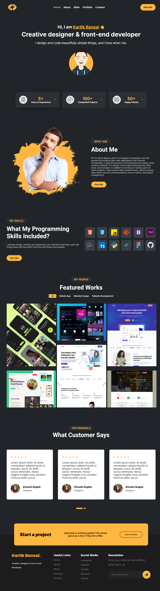

# Final Task - Web Page Description

This project involves creating a modern and engaging web page for a creative designer and front-end developer. The page features the following sections:

## Example

Here’s a preview of the landing page:

## Header
- **Logo**: Displays the brand logo with an animated entrance.
- **Navigation**: Contains links to Home, About, Skills, Portfolio, and Contact with interactive animations.
- **Call-to-Action**: A prominent "Hire Me" button.

## Welcome Section
- **Introduction**: Greets visitors with a personal message and introduction of Kartik Bansal, highlighting his role as a creative designer and front-end developer.
- **Avatar**: An animated avatar image to represent the designer.

## Cards Section
- **Experience**: Showcases years of experience with an animated card.
- **Projects**: Highlights completed projects with an animated card.
- **Clients**: Displays the number of happy clients with an animated card.

## About Me Section
- **Photo**: Features a photo of Kartik Bansal.
- **Description**: Provides details about Kartik's passion for clean web applications, creative solutions, and collaborative work.

## Skills Section
- **Skills Overview**: Lists programming and design skills with icons representing technologies such as HTML, CSS, JavaScript, and more.
- **Call-to-Action**: Includes a button to "Hire Me."

## Works Section
- **Featured Works**: Showcases selected projects with images.
- **Filter Navigation**: Allows filtering of works by category (All, Mobile App, Website Design, Website Development).

## Customer Testimonials Section
- **Reviews**: Displays customer reviews with star ratings and client testimonials.
- **Navigation**: Includes navigation for browsing through testimonials.

## Project Section
- **Call-to-Action**: Encourages starting a new project with a personal invitation to connect.

## Footer
- **Branding**: Shows the designer's name and a brief description.
- **Useful Links**: Lists links to Home, About, Skills, Portfolio, and Contact.
- **Social Media**: Provides links to social media profiles (Instagram, LinkedIn, Dribble, Behance, GitHub).
- **Newsletter**: Allows users to subscribe to updates with an email input form.

The page utilizes animations from Animate.css and a responsive design to ensure a modern and user-friendly experience across devices.
