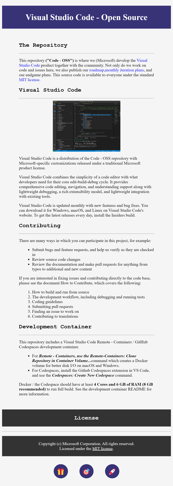

# Visual Studio Code - Open Source

## Overview

Lab 1 involves creating a simple web page that provides an overview of the Visual Studio Code - Open Source project. The page includes basic HTML structure, CSS for styling, and an image to enhance visual appeal.

## Example

Here’s a preview of the web page with the image included:

## Code Structure

The code for Lab 1 is organized into two main files: `index.html` and `style.css`.

### HTML (`index.html`)

- **`<head>`**: Contains meta tags for character set, viewport settings, and a link to the CSS stylesheet.
- **`<body>`**: Includes the main content of the page:
  - **`<h1 class="headline">`**: Displays the main title of the page with specific styling.
  - **`
`**: Encloses the content sections:
    - **Section Headers (`<h2>`)**: Organize the content into distinct sections.
    - **Paragraphs (`
`)**: Provide detailed descriptions about the Visual Studio Code project.
    - **Image (``)**: Shows a relevant image with centered alignment and scaled width.
    - **Lists (`<ul>`, `<ol>`)**: Present contributing guidelines and development container details in a structured format.
  - **Footer (`<h2 class="first footer">` and `
`)**: Displays licensing information and contact details.
  - **Icons (`<ul class="icons">`)**: Adds visual icons at the bottom of the page for a decorative touch.

### CSS (`style.css`)

- **Global Styles**:
  - **`body`**: Sets the background color for the entire page.
  - **`a`**: Removes the underline from hyperlinks.
- **Headline Styling**:
  - **`.headline`**: Styles the page title with a background color, text color, padding, and text alignment.
- **Container and Layout**:
  - **`.container`**: Centers the main content and sets its width to 80%.
  - **`.image`**: Centers the image and sets its width to 50% of the container.
- **Lists and Footer**:
  - **`ul, ol`**: Adds padding to lists for proper alignment.
  - **`.footer`**: Styles the footer with a dark background color, white text, and padding.
- **Icons**:
  - **`.icon`**: Styles icons with a background color, border radius, padding, and margin.

## Getting Started

To view the web page, open `index.html` in a web browser. You will see a formatted page with an overview of the Visual Studio Code - Open Source project, including text, styling, and an image.

## License

This project is licensed under the [MIT License](https://github.com/microsoft/vscode/blob/main/LICENSE.txt).
