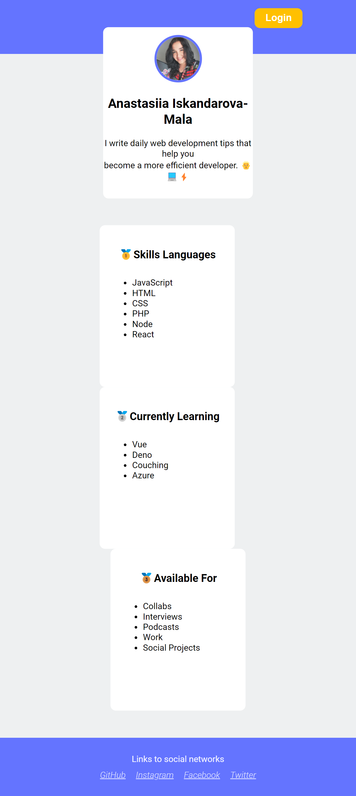

# Anastasiia Iskandarova-Mala's Personal Webpage

## Overview

This project is a personal webpage for Anastasiia Iskandarova-Mala. It provides a snapshot of her skills, current learning areas, and available opportunities. The webpage features a clean and modern design, using HTML and CSS, and includes a login button and social media links.

## Example

Here’s a preview of the webpage:

## Code Structure

The code for the webpage is organized into two main files: `index.html` and `style.css`.

### HTML (`index.html`)

- **`<head>`**: Contains meta tags for character set, viewport settings, and a link to the CSS stylesheet.
- **`<body>`**: Includes the main content of the page:
  - **`<header>`**: Features a login button that directs to another page (`../LR3/ex1/index.html`).
  - **`<main>`**: Contains the core content:
    - **`<section>`**: Displays a profile section with a photo and brief bio.
    - **`<section>`**: Lists skills, current learning areas, and availability.
  - **`<footer>`**: Provides links to social networks.

### CSS (`style.css`)

- **Global Styles**:
  - **`*`**: Resets margin and padding for all elements.
  - **`body`**: Sets the background color and font family for the page.
- **Header**:
  - **`header`**: Styles the header with a background color and fixed height.
  - **`.login`**: Styles the login button with padding, background color, border radius, and text color.
- **Main Content**:
  - **`.main-wrapper`**: Styles the profile section with a white background, rounded corners, and centered text.
  - **`.photo`**: Styles the profile photo with a border, border radius, and margin.
  - **`.name`**: Adds margin to the profile name.
  - **`.info`**: Styles the bio section with margin and padding.
- **Sections**:
  - **`.wrapper`**: Centers the content and adds vertical margins.
  - **`.block`**: Styles the blocks for skills, current learning, and availability with a background color, dimensions, and margin.
  - **`.headline`**: Styles the section headers with font size and margin.
  - **`.list`**: Adds margin and padding to lists.
- **Footer**:
  - **`footer`**: Styles the footer with a background color.
  - **`.social-networks`**: Styles the social media section with text color, padding, and opacity.
  - **`.links`**: Styles the links list with margin, padding, and font style.
  - **`.links li`**: Styles individual list items with margin and font weight.
  - **`.links li a`**: Styles the links with color and opacity.

## Getting Started

To view the webpage, open `index.html` in a web browser. The page showcases a profile with a photo, skills, current learning areas, and available opportunities, along with a login button and social media links.

## License

This project is licensed under the [MIT License](LICENSE.txt).
