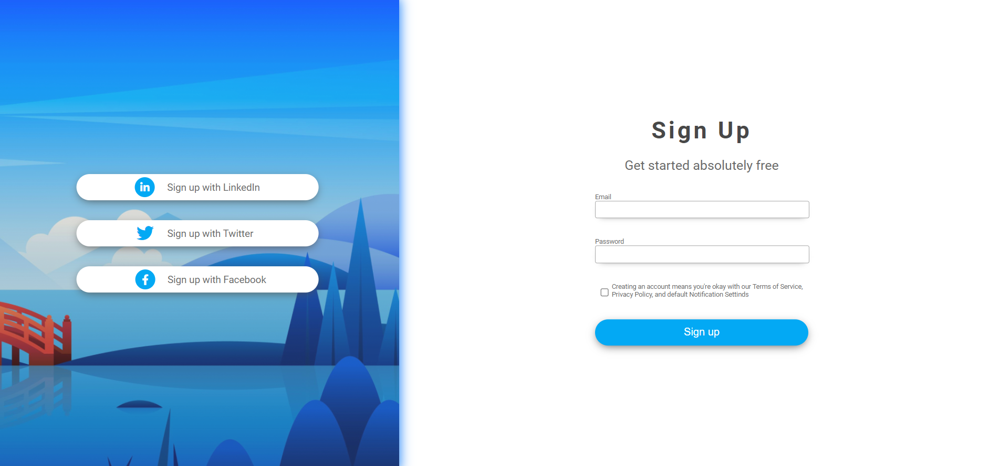
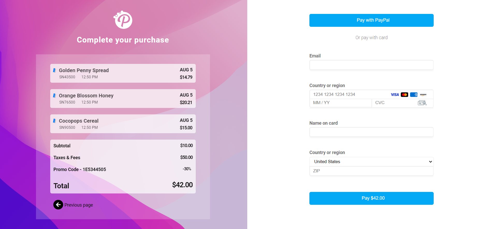

# Exercise 1 - Sign-Up Form

This project contains the HTML and CSS for a sign-up form that is part of a personal webpage. The page is designed with a modern, clean interface and includes options to sign up using LinkedIn, Twitter, or Facebook. The form is responsive and includes subtle shadows and rounded corners for a sleek appearance.

## Example

Here’s a preview of the webpage:

## Key Components

### HTML Structure

#### DOCTYPE Declaration & Meta Tags:
- The document is declared as HTML5 with the `<!DOCTYPE html>` tag.
- The page is set to use UTF-8 character encoding.
- The viewport is configured for responsive design with `meta name="viewport"`.

#### External Resources:
- The page links to an external CSS file (`style.css`).
- FontAwesome is included via a script to provide social media icons.

#### Container Layout:
- The main content is wrapped inside a `div` with the class `container`, further divided into two columns:
  - **Column 1 (40% width):** Contains buttons for signing up using social media platforms.
  - **Column 2 (60% width):** Contains the sign-up form with email, password fields, and a submit button.

#### Social Media Sign-Up Buttons:
- Buttons are created using anchor (`<a>`) tags styled with CSS to include an icon inside a circle, followed by descriptive text.
- The buttons include options for LinkedIn, Twitter, and Facebook sign-up.

#### Form:
- The sign-up form includes:
  - A title with the main header (`Sign Up`) and a subheader (`Get started absolutely free`).
  - Input fields for email and password.
  - A checkbox for agreeing to terms of service and privacy policy.
  - A submit button to complete the sign-up.

### CSS Styling

#### Fonts and Colors:
- The page uses the `Roboto` font family from Google Fonts.
- A primary color of `#03A9F4` (a shade of blue) is used throughout the design.

#### Container and Row Structure:
- The layout uses a flexbox-like structure with `.col-40` and `.col-60` classes to control the width of the two columns.
- The left column has a background image and box shadow effects for depth.

#### Buttons and Inputs:
- The buttons have a modern design with shadows, rounded corners, and hover effects.
- Inputs are styled with a subtle shadow and border.

#### Form Styling:
- The form is centered within its column and includes margin adjustments to maintain vertical alignment.
- The submit button has a primary blue background, with white text and shadow effects for emphasis.

### Responsive Design Considerations
- The layout is built with a percentage-based width, ensuring that it adapts to different screen sizes.
- The page uses box shadows, rounded corners, and icon positioning techniques to create a visually appealing interface that scales well across devices.

# # Exercise 2 - Payment Checkout Page

This project contains the HTML and CSS for a payment checkout page. The page displays a summary of purchases, a payment form, and options to pay via PayPal or with a card. The design is modern, clean, and responsive, with visually appealing elements like background images, shadows, and rounded corners.

## Example

Here’s a preview of the payment checkout page:

## Key Components

### HTML Structure

#### DOCTYPE Declaration & Meta Tags:
- The document is declared as HTML5 with the `<!DOCTYPE html>` tag.
- The page uses UTF-8 character encoding.
- The viewport is configured for responsive design with `meta name="viewport"`.

#### External Resources:
- The page links to an external CSS file (`style.css`).
- FontAwesome is included via a script to provide icons for navigation and other elements.

#### Container Layout:
- The main content is wrapped inside a `div` with the class `container`, which is divided into two sections:
  - **Complete Your Purchase (50% width):** Displays the list of items to be purchased, along with the total amount, taxes, fees, and promo code.
  - **Payment Form (50% width):** Includes options to pay via PayPal or with a card, along with fields for email, card details, and billing information.

#### Purchase Summary:
- Each item in the purchase list is displayed in a block with a title, product code, time, date, and price.
- The total section includes subtotal, taxes, promo discount, and the final total.

#### Payment Form:
- The form includes:
  - Payment options: Pay with PayPal or card.
  - Input fields for email, card number, expiration date, CVC, and name on card.
  - A dropdown to select the country or region.
  - A ZIP code field.
  - A submit button to complete the payment.

### CSS Styling

#### Fonts and Colors:
- The page uses the `Roboto` font family from Google Fonts.
- The primary color is `#03A9F4` (blue), used for buttons and other key elements.

#### Layout and Backgrounds:
- The `.complete` section has a background image with a gradient overlay for visual depth.
- The `.pay` section is on the right side, with a clean white background for the form.
- Box shadows and rounded corners are applied to various elements to create a modern look.

#### Buttons and Inputs:
- Buttons are styled with a primary blue background, white text, and shadow effects.
- Inputs have subtle shadows and borders, with specialized styling for the card number and CVC fields.

#### Form Styling:
- The form is structured with clear labels, placeholders, and responsive spacing.
- The submit button has a bold design, with emphasis on the payment amount.

### Responsive Design Considerations
- The layout uses percentage-based widths, allowing the page to adapt to different screen sizes.
- Flexbox is used to manage the alignment and spacing of elements.
- The page ensures a consistent look across devices with the use of media queries, shadows, and rounded corners.
