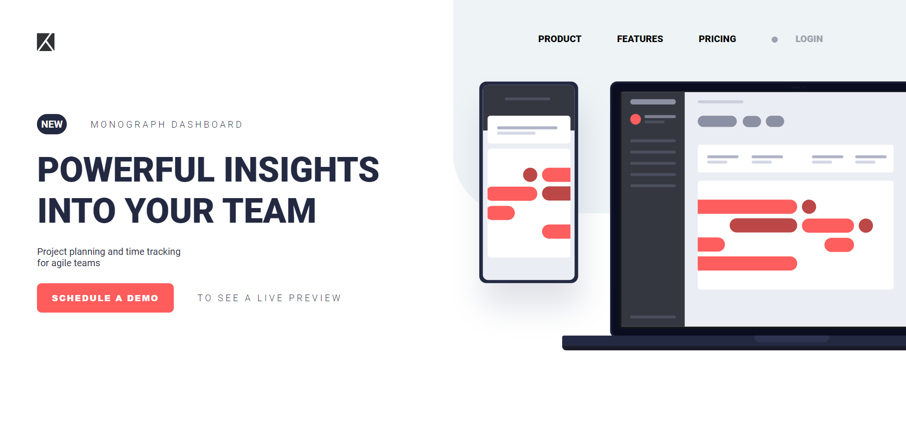

# Monograph Dashboard Landing Page

This project contains the HTML and CSS for a landing page promoting the Monograph Dashboard, designed for project planning and time tracking in agile teams. The page features a modern and responsive design with a focus on clean typography, effective use of space, and visual hierarchy.

## Example

Here’s a preview of the landing page:

## Key Components

### HTML Structure

#### DOCTYPE Declaration & Meta Tags:
- The document is declared as HTML5 with the `<!DOCTYPE html>` tag.
- The page uses UTF-8 character encoding.
- The viewport is configured for responsive design with `meta name="viewport"`.

#### External Resources:
- The page links to an external CSS file (`style.css`).
- Google Fonts is used to include the `Roboto` font family.
- FontAwesome is used to provide icons, including those for navigation.

#### Container Layout:
- The main content is wrapped inside a `div` with the class `container`, divided into two sections:
  - **Headlines Section (50% width):** Includes a logo, a "NEW" tag, the main headline, a subheadline, and a button to schedule a demo.
  - **Image Section (50% width):** Features background styling and an illustration of devices showing the dashboard interface.

#### Headlines Section:
- The logo is displayed at the top left, followed by a "NEW" tag inside an ellipse.
- The main headline `POWERFUL INSIGHTS INTO YOUR TEAM` is emphasized with large, bold typography.
- A button labeled `SCHEDULE A DEMO` is provided, followed by a smaller headline `TO SEE A LIVE PREVIEW`.

#### Navigation Menu:
- The menu includes links for `PRODUCT`, `FEATURES`, `PRICING`, and a `LOGIN` button.
- The navigation is centered within the image section and styled with flexbox.

#### Image Section:
- The image section includes a background with a border-radius effect and an illustration of devices displaying the dashboard.
- The background color and layout provide a contrast to the headlines section, drawing attention to the central message.

### CSS Styling

#### Fonts and Colors:
- The page uses the `Roboto` font family from Google Fonts.
- The primary color scheme includes shades of blue (#242942) and red (#FF5C5C).

#### Layout and Flexbox:
- The layout uses flexbox to align and distribute content within the container, headlines, and image sections.
- The `.container` class is used to manage the overall layout, with responsive adjustments made using media queries.

#### Buttons and Typography:
- The `SCHEDULE A DEMO` button is styled with a red background, white text, and rounded corners.
- The headlines use large, bold typography to create a strong visual hierarchy.
- Subheadings and supporting text use lighter font weights and smaller sizes to maintain balance.

#### Responsive Design Considerations:
- Media queries are used to adjust the layout, font sizes, and spacing for different screen sizes.
- The layout adapts to smaller screens by stacking the headlines and image sections vertically, ensuring readability and usability on mobile devices.
- Flexbox properties are adjusted to center content and manage alignment on smaller screens.

### Media Queries

#### Large Screens (1400px and above):
- The main headline is set to a font size of 58px.
- The navigation menu maintains large spacing between items.

#### Medium Screens (1200px and above):
- The main headline is reduced to a font size of 50px.
- The `SCHEDULE A DEMO` button size is reduced slightly for better fit.

#### Small Screens (992px and below):
- The layout switches to a vertical orientation with the headlines section placed above the image section.
- The headlines are centered, and the logo is repositioned to maintain balance.

#### Extra Small Screens (600px and below):
- The headlines section content is centered vertically.
- The navigation menu items are stacked vertically with reduced spacing for better fit.

### Additional Considerations
- The layout ensures that key messages are easily accessible and visible on all devices.
- The use of flexbox and responsive design principles allows for smooth adaptation to various screen sizes without compromising the user experience.
