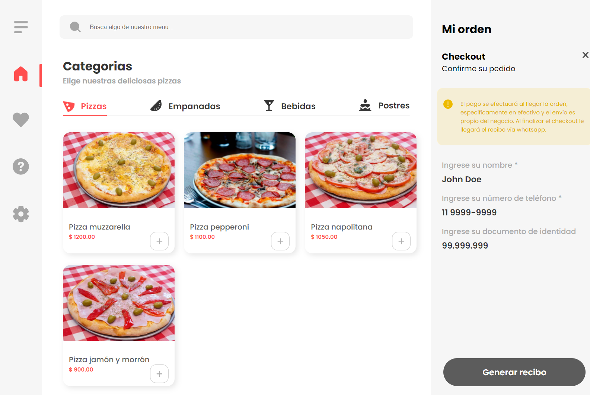

# Interactive Web Page

## Description

This project involves creating a simple interactive web page with a modern and user-friendly design. The page includes:

- A navigation menu with icons
- A search input field
- Categorized sections showcasing various items

## Example

Here’s a preview of the landing page:

## Features

- **Responsive Design**: The layout adjusts to different screen sizes for optimal viewing.
- **Interactive Navigation**: Includes icons for navigation, which change appearance when active.
- **Search Functionality**: A search input field to filter content dynamically.
- **Categorized Content**: Sections for various categories with descriptive text.

## Files

- `index.html`: The main HTML file containing the structure of the web page.
- `style.css`: The CSS file for styling the web page.

## CSS Styles

### Variables

- **Colors:**
  - `$based-color`: #A6A6A6
  - `$based-color-categories`: #353535
  - `$active-color`: #FF4E4E
  - `$bg-color`: #F6F6F6

- **Font Weights:**
  - `$Bold`: 700
  - `$Semibold`: 600
  - `$Medium`: 500
  - `$Regular`: 400

### Mixins

- **`text($font-size, $weight, $color)`**: Applies font size, weight, and color.
- **`active($is-active)`**: Styles for active elements, changing color to `$active-color` if active.
- **`categories($is-active)`**: Displays flex and applies active color if active.

### Keyframes

- **`active-animation`**: Rotates an element 360 degrees to create an animation effect.

### Global Styles

- **`*`**: Resets padding and margin.
- **`body`**: Sets font family, hides horizontal overflow, and configures layout.

### Layout

- **`#container`**: Defines the grid layout with areas for navigation, main content, and additional information.
  - **`#nav`**: Styles the navigation area with background color and icon display.
  - **`#main`**: Contains the main content including search input, categorized sections, and cards.
  - **`#info`**: Displays additional information with a background color and styled text blocks.

### Navigation

- **`#nav`**:
  - Uses flexbox for menu alignment.
  - Styles for list items, icons, and active states.
  - Icons change color when active and include a rotating animation.

### Main Content

- **`input`**: Styles the search input with a background image and rounded corners.
- **`.categorias`**: Styles for categorized sections with headings and descriptive text.
- **`#cards`**: Grid layout for displaying items with card styles, including background images and hover effects.

### Responsive Design

- **Media Queries**:
  - **Small Screens (max-width: 576px)**: Adjusts layout to stack sections vertically and hides certain elements for mobile view.
  - **Medium to Extra Large Screens**: Maintains responsive adjustments for various screen sizes, including changes in font sizes and layout arrangements.

### Additional Considerations

- Ensures a user-friendly experience across all devices.
- Uses flexbox and responsive design principles for adaptable layouts.
- Includes detailed styling for interactive elements, navigation, and content presentation.

For more details, refer to the `style.css` file for the complete CSS code.
