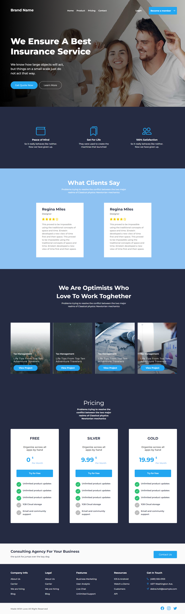

# Insurance Service Web Page

## Description

This project involves creating an insurance service web page with a modern and engaging design. The page includes:

- A header with navigation and branding
- Sections for features, client testimonials, projects, pricing plans, and contact information
- A footer with social media links

## Example

Here’s a preview of the landing page:

## Features

- **Header with Navigation**: Includes brand name, navigation links, and call-to-action buttons.
- **Features Section**: Showcases key features of the insurance service with icons and descriptions.
- **Client Testimonials**: Displays customer reviews with star ratings.
- **Projects Section**: Highlights different projects with call-to-action buttons.
- **Pricing Plans**: Provides different pricing tiers with features and a "Try for free" button.
- **Contact Section**: Offers a button to get in touch for consulting.
- **Footer**: Contains social media links and a copyright notice.

## Files

- `index.html`: The main HTML file containing the structure of the web page.
- `style.css`: The CSS file for styling the web page.

## CSS Styles

### Variables

- **Colors:**
  - `$primary-color`: #007bff
  - `$secondary-color`: #6c757d
  - `$background-color`: #f8f9fa
  - `$text-color`: #212529

- **Font Weights:**
  - `$Bold`: 700
  - `$Semibold`: 600
  - `$Medium`: 500
  - `$Regular`: 400

### Mixins

- **`text($font-size, $weight, $color)`**: Applies font size, weight, and color.
- **`btn($bg-color, $text-color)`**: Styles buttons with background and text colors.
- **`card($border-radius)`**: Applies border radius and box shadow to card elements.

### Keyframes

- **`bounce-in`**: Animates elements with a bounce effect when they appear.

### Global Styles

- **`*`**: Resets padding and margin for consistency.
- **`body`**: Sets font family, base text color, and background color.

### Layout

- **`header`**: Styles for the header, including navigation and branding.
  - **`.bar`**: Flex container for the brand and navigation links.
  - **`.nav-buttons`**: Styles for login and membership buttons.

- **`section`**: Styles for various sections of the page.
  - **`.points`**: Displays features with cards.
  - **`.comments`**: Shows client testimonials with star ratings.
  - **`.projects`**: Highlights different projects with cards.
  - **`.pricing`**: Details pricing plans with different tiers.
  - **`.contact`**: Provides a contact button for consulting.

- **`footer`**: Styles the footer with social media icons and copyright notice.

### Navigation

- **`header nav`**:
  - Uses flexbox for alignment.
  - Styles navigation links and buttons.
  - Includes animations for interactive elements.

### Main Content

- **`.card`**: Styles for feature and project cards with icons and text.
- **`.btn`**: Styles for buttons including primary and secondary types.
- **`.stars`**: Displays star ratings with SVG images.

### Responsive Design

- **Media Queries**:
  - **Small Screens (max-width: 576px)**: Adjusts layout for mobile view, including stacking elements vertically and resizing text.
  - **Medium to Extra Large Screens**: Ensures responsive adjustments for various screen sizes, maintaining usability and readability.

### Additional Considerations

- Provides a modern and user-friendly experience across all devices.
- Utilizes Bootstrap for responsive design and animations.
- Includes detailed styling for interactive elements, navigation, and content presentation.

For more details, refer to the `style.css` file for the complete CSS code.
